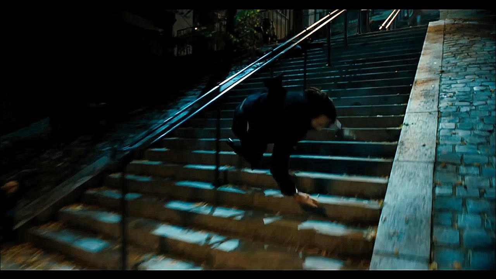

# Седмица 12 - Рекурсия. Рекурсивни алгоритми.

## Задача 1 :100: (Аритметика) :100:

Създайте програма, която приема две неотрицателни цели числа от стандартния вход и извежда на стандартния изход съответните резултати, използвайки само атомарни операции и рекурсивни механизми и предишни резултати, които сте изготвили:

* $A + B$
* $A \cdot B$
* $A ^ B$

> Атомарни операции означава неделими операции. Използвайте факта, че $A + B = (A + 1) + (B - 1)$, $A \cdot B = A + (A \cdot (B - 1))$, $A^{B} = A \cdot A^{B - 1}$. По този начин за всеки пункт в задачата създайте необходимата рекурсивна дефиниция и декомпозирайте операциите при съответните им рестрикции.

## Задача 2 :heavy_plus_sign: (Сума в Масив) :heavy_plus_sign:

Създайте програма, която приема размер на масив от стандартния вход и заделя динамично памет за него. След това от стандартния вход се въвеждат самите елементи на масива, а на стандартния изход се извежда сумата и елементите на масива, като тези резултати се изчисляват рекурсивно.

## Задача 3 :curly_loop: (Филтър и Апликатив върху Масив) :curly_loop:

Създайте програма, която приема размер на масив и от стандартния вход и заделя динамично памет за него. След това от стандартния вход се въвеждат самите елементи на масива, а на стандартния изход се извеждат следните резултати, използвайки само рекурсивни механизми:

* Брой четни елементи в масива;
* Брой нечетни елементи в масива;
* Копие на масива, но върху всеки елемент е приложена функцията за повдигане на квадрат;
* Копие на масива, но върху всеки елемент е приложена функцията за повдигане на куб;

## Задача 4 🪜 (Стълби - Уик) 🪜

Джон Уик отново изкачва стълби... Въпреки че му остава малко време до изгрев слънце, той иска да знае по колко различни начина може да стигне до `Sacre Coeur`, ако за един ход може да изкачи едно или две стъпала. Създайте програма, която приема от стандартния вход брой стълби, които Джон трябва да изкачи. На стандартния изход изведете броя начини, по които Джон може да изкачи цялото стълбище.

## Задача 5 :imp: (Балансирани Скоби) :imp:

Създайте програма, която приема от стандартния вход естествено число `N` и извежда на стандартния изход всички символни низове, състоящи се само от `N` леви и `N` десни скоби, като тези поредици са балансирани. Забележете, че дължината на целия низ винаги е `2 * N`.

## Задача 6 :fire: (Конфигурации без Повторения) :fire:

Създайте програма, която приема от стандартния вход размер на масив и заделя динамично памет за него, а след това приема и неговите елементи, за които приемете, че са уникални. На стандартния изход изведете следните резултати:

* Всички пермутации без повторение.
* Всички вариации без повторение на `K` елемента (`K` се въвежда от стандартния вход).
* Всички комбинации без повторение на `K` елемента (`K` се въвежда от стандартния вход).

## Задача 7 :eyes: (Подмножества на Множество) :eyes:

Създайте програма, която приема от стандартния вход размер на масив и заделя динамично памет за него, а след това приема и неговите елементи, за които приемете, че са уникални. На стандартния изход изведете всички подмножества на дадения масив. Теоретичен резултат е, че при множество с дължина `N`, броят на всички подмножества е $2^N$.

## Задача 8 🧭 (Капитан Джак Спароу) 🧭

Създайте програма, която приема от стандартния вход размери на правоъгълна таблица. Нека в долния ляв ъгъл се намира капитан Джак Спароу, а в горния десен ъгъл е неговата Черна Перла. Джак Спароу много иска да си върне Черната Перла и не може да живее без този кораб, затова иска час по-скоро да стигне до него. Намерете всички възможни начини това да стане, ако Джак може да прави само ход надясно или ход нагоре в рамките на таблицата, без да се връща назад.

## Задача 9 :cat: (Взаимодествие между Символни Низове) :cat:

Създайте програма, която приема два символни низа, заделени с точна големина, от стандартния вход. На стандартния изход изведете дали първият символен низ е префикс или суфикс на втория, като използвате рекурсивни механизми.

## Задача 10 📖 (Булеви Вектори) 📖

Създайте програма, която приема число `N` и извежда на стандартния вход всички булеви вектори с дължина `N`. Булев вектор се нарича поредица от числа, в която всеки елемент има или стойност `0`, или стойност `1`. След това изведете на стандартния изход всички булеви вектори с дължина `N`, в които сумата на елементите в първата половина на вектора е равна на сумата на елементите във втората половина на вектора.

## Задача 11 🕸 (Координатна Мрежа) 🕸

Създайте програма, която приема от стандартния вход координати на точка $(x_{1}, y_{1})$ и точка $(x_{2}, y_{2})$. Намерете по колко различни начина може да се стигне от едната точка до другата, ако може да се прави само ход надолу, ход нагоре, ход наляво, надясно, в зависимост от въведените координати на точките, без да се прави ход назад в смисъла на аритметично кенселиране.

## Задача 12 🖧 (Търсене на Области) 🖧

Създайте програма, която приема от стандартния вход матрица с елементи от стойности, които са `0` или `1`. На стандартния изход изведете броя на областите, които съдържат съседни стойности `1`. Приемаме, че съседството се определя от посоките нагоре, надолу, наляво, надясно, т.е. диагоналите не се взимат предвид.

## Задача 13 👹 (Луцифер) 👹

*Число на Падналия Ангел* ще наричаме число, цифрите на което, повдигнати на степен съответната позиция на цифрата в дсетичния запис на числото, се сумират до самото число. Пример за такова число е `135`. Създайте програма, която прочита от станадртния вход число и извежда на стандартния изход дали числото е число на Падналия Ангел, използвайки само рекурсивни механизми.
